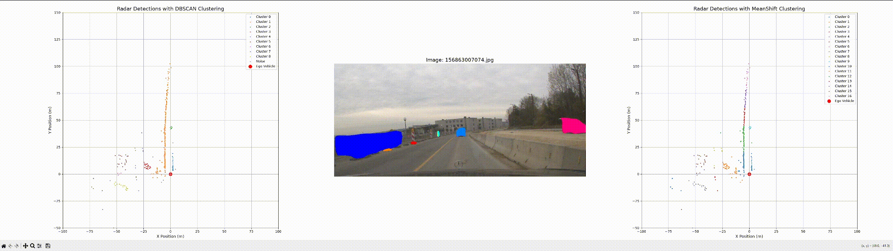
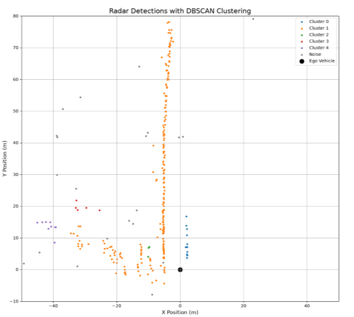
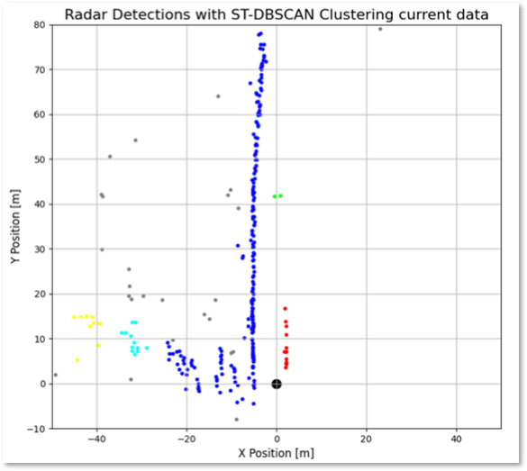
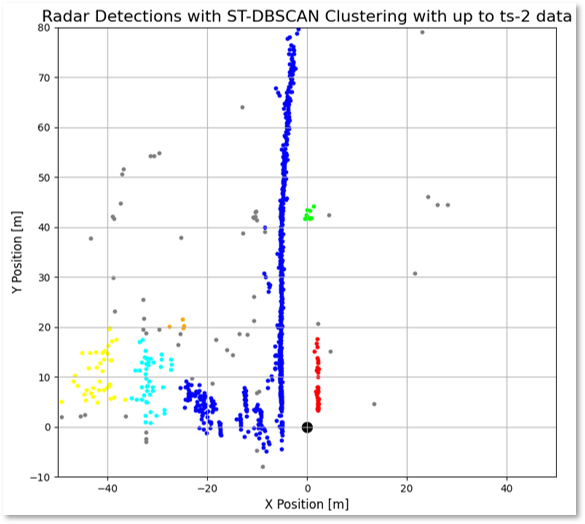

# RADAR Point Cloud Clustering & Spatio-Temporal Analysis
An automotive radar point cloud pipeline evaluating spatial and spatio-temporal density-based clustering algorithms (DBSCAN, MeanShift, and ST-DBSCAN) on the RadarScenes dataset to segment dynamic objects under noisy measurements.

---

## Overview
This repository contains a Python-based pipeline for point cloud clustering and spatio-temporal analysis on automotive radar data using the **RadarScenes** dataset.
Developed as part of a university project for the *Sensorik* module, this project evaluates density-based clustering algorithms—specifically **DBSCAN**, **MeanShift**, and **ST-DBSCAN**—to segment radar reflections into coherent dynamic object clusters (e.g., vehicles, pedestrians).

---

## Visualization

### Clustering Comparison (DBSCAN vs. MeanShift)

*Real-time animated comparison of DBSCAN (left) vs. MeanShift (right) aligned with front-facing camera context (center).*

---

### Spatio-Temporal Clustering & Tracking (ST-DBSCAN)

| 1. Standard Spatial DBSCAN | 2. ST-DBSCAN (Current Detections) | 3. ST-DBSCAN (Accumulated History $t \le ts-2$) |
| :---: | :---: | :---: |
|  |  |  |
| *Spatial-only clustering on the current frame.* | *Current frame detections clustered via ST-DBSCAN (e.g., leading vehicle correctly segmented).* | *Full spatio-temporal point cloud ($t, t-1, t-2$) revealing the point density that enabled cluster detection.* |

---

## Features
* **Multi-Sensor Data Integration**: Merges irregular radar detections from 4 automotive sensors and integrates ego-vehicle odometry.
* **Density-Based Clustering Algorithms**:
  * **DBSCAN**: Fast spatial clustering evaluating coordinate proximity and radial velocity.
  * **MeanShift**: Density-gradient tracking evaluating centroid convergence.
  * **ST-DBSCAN**: Spatio-Temporal DBSCAN incorporating spatial distance ($\varepsilon$), temporal window ($\varepsilon_t$), and velocity weights ($\alpha$) for cross-frame cluster persistence.
* **Integrated Camera & RADAR Visualization**: Synchronized animated plot displaying ego-centered DBSCAN and MeanShift clustered radar point clouds alongside camera footage.
* **Ground Truth & RCS Analysis**: Visualizes ground truth clusters and Radar Cross Section (RCS) of radar returns.
* **Statistics**: Evaluation and comparison of cluster density, and cluster size across whole dataset.

---

## Results & Comparative Analysis

Evaluation across multiple sequence scenarios highlights significant performance trade-offs:

| Metric / Property | DBSCAN | MeanShift | ST-DBSCAN |
| :--- | :--- | :--- | :--- |
| **Connected Object Discovery** | Good (captures chain-like formations) | Poor (tends to cluster single objects into multiple) | Excellent (adds temporal component) |
| **Avg. Runtime** | **Very Fast** | Slow | Moderate |
| **Cluster Persistence & Tracking** | None (frame-independent) | None (frame-independent) | **High** (tracks cluster over time) |
| **Noise Resilience** | Moderate | Low | **High** (filters transient clutter using temporal history) |
| **Parameter Complexity** | Low ($\varepsilon$, `minPoints`) | Low (Bandwidth) | Higher ($\varepsilon$, $\varepsilon_t$, `minPoints`, $\alpha$) |

### Key Takeaways:

1. **DBSCAN** is computationally superior for real-time automotive processing compared to MeanShift.
2. **MeanShift** mostly suffers from over-segmentation, splitting single objects into multiple smaller clusters.
3. **ST-DBSCAN** introduces temporal continuity, enabling object cluster tracking across consecutive radar scans while suppressing temporary clutter.

---

## Repository Structure

```text
radar_point_cloud_clustering/
├── assets/                                   # GIFs and plots for README
│   ├── clustering_comparison.gif
│   ├── dbscan_spatial.png
│   ├── st_dbscan_current.png
│   └── st_dbscan_multiframe.png
├── src/
│   ├── clustering_comparison.py              # Side-by-side animated visualization for comparing DBSCAN and MeanShift
│   ├── clustering_DBSCAN.py                  # Standard spatial DBSCAN algorithm
│   ├── clustering_Meanshift.py               # MeanShift clustering algorithm
│   ├── clustering_ST_DBSCAN_single_step.py   # Spatio-Temporal DBSCAN algorithm implementation with single step plots
│   ├── constants.py                          # Global settings
│   ├── functions.py                          # Data loading, coordinate transforms, and utils
│   ├── plot_ground_truth.py                  # Ground truth annotation plotter
│   ├── plot_rcs.py                           # Radar Cross Section distribution plotter
│   └── statistics.py                         # Statistics extraction over all data
├── .gitignore
├── environment.yml
└── README.md
```

---

## Dependencies

* **Python 3.12**
* **NumPy**
* **Matplotlib**
* **scikit-learn**
* **h5py**
* **SciPy**
* **pynput**

---

## Usage

### 1. Dataset Preparation
Download the **RadarScenes** dataset from [radar-scenes.com](https://radar-scenes.com/) extract them and edit `src/constants.py` to set file location.

### 2. Environment Setup and Running Scripts
```bash
conda env create -f environment.yml
conda activate radar_scenes_clustering

# compare DBSCAN vs. MeanShift (Interactive Animation)
python src/clustering_comparison.py
# (Press Space during execution to pause or resume the animation)

# run Spatio-Temporal DBSCAN (ST-DBSCAN)
python src/clustering_ST_DBSCAN_single_step.py

# plot Ground Truth Annotations & Bounding Boxes
python src/plot_ground_truth.py

# generate Benchmark Statistics
python src/statistics.py
```

---

## References

* **Paper Reference**:
  > Ole Schumann, Markus Hahn, Nicolas Scheiner, Fabio Weishaupt, Julius F. Tilly, Jürgen Dickmann, and Christian Wöhler.  
  > *"RadarScenes: A Real-World Radar Point Cloud Data Set for Automotive Applications"*, 2021.
* **Dataset**: [RadarScenes: A Real-World Radar Point Cloud Data Set for Automotive Applications](https://radar-scenes.com/)

---

## Credits
Developed as a university group project by:
* **[Philip Reutter](https://github.com/Philip-Reutter)**
* **[Hannes Schrof](https://github.com/HannesSchrof)**
